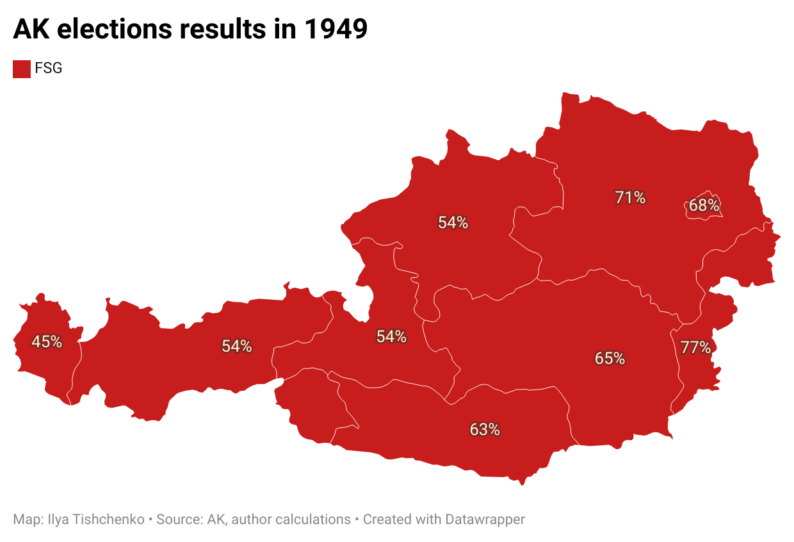

# Repository about AK Wahl \| Chamber of Labour elections

-   [summary note](https://vearlen.github.io/ak_wahl/)

-   Data are in folder `/data`

    Source of data: AK, Ilya Tishchenko. \
    License: [CC BY-NC-SA 4.0](http://creativecommons.org/licenses/by-nc-sa/4.0/?ref=chooser-v1)

    {width="700"}
